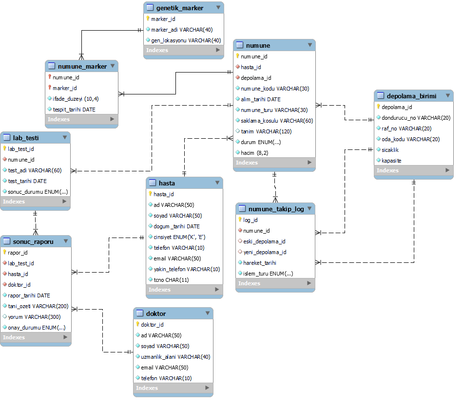

# 🧬 Biobank Management System (BMS)


A comprehensive relational database solution designed to unify patient samples, laboratory tests, genetic marker analyses, and logistics processes in biobanking.

## 🚀 Key Features

* **Architectural Depth:** Designed with a **3NF (Third Normal Form)** structure featuring 9 tables and **15 strategic relationships (Foreign Keys)**.
* **Massive Dataset:** Includes a robust dataset of **450+ realistic medical records (DML)** to ensure system scalability and data consistency.
* **Advanced Constraints:**
    * Data validation using **REGEXP** (for National ID and Phone numbers).
    * State management via **ENUM** types to minimize manual entry errors.
    * Referential integrity enforced with `ON DELETE RESTRICT/CASCADE`.
* **Traceability:** A dedicated `NUMUNE_TAKIP_LOG` system to track every movement and status change of samples.

---

## 📊 Entity Relationship Diagram (ERD)



---

## 🏗️ Data Modeling & Normalization

The project strictly follows normalization principles to eliminate data redundancy:
1.  **1NF:** Ensured atomic values for all fields and removed repeating groups.
2.  **2NF:** Removed partial dependencies by ensuring all non-key attributes are fully functional dependent on the Primary Key.
3.  **3NF:** Eliminated transitive dependencies to prevent update, insertion, and deletion anomalies.

---

## 💻 Setup & Usage

1.  Clone the repository:
    ```bash
    git clone [https://github.com/kubrakayan/biobank-management-database.git](https://github.com/kubrakayan/biobank-management-database.git)
    ```
2.  Import the schema:
    ```sql
    SOURCE sql/tablo_olusturma.sql;
    ```
3.  Load the data (450+ records):
    ```sql
    SOURCE sql/veri_ekleme.sql;
    ```

## 🛠️ Skills Demonstrated
* **RDBMS:** MySQL
* **Design:** Schema Design, ER Diagramming, Normalization (1NF/2NF/3NF)
* **Security & Integrity:** Data Validation, Constraints, Traceability

---
